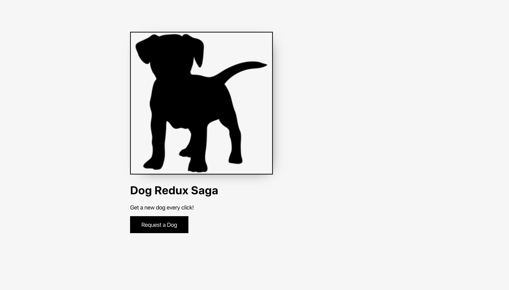
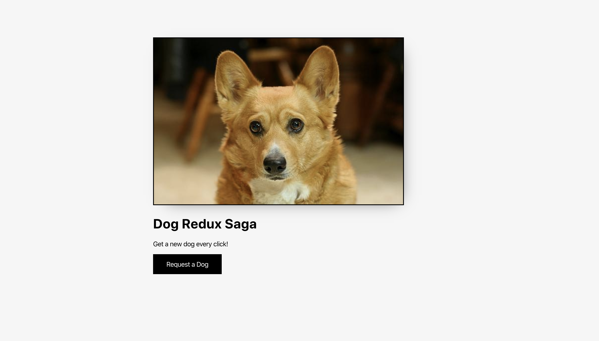

Basic React Redux application to assist in learning the ins and outs of Redux-saga

# Screenshots

# Tech

- Redux
- Redux Saga
- React
- create-react-app
- NPM

# Redux Saga Dog App Recap:

- An event takes place — e.g. user does something (clicks “Request a Dog” button) or an update occurs (like componentDidMount)
  Based on the event, an action is dispatched, likely through a function declared in mapDispatchToProps (e.g.onRequestDog)
- A watcherSaga sees the action and triggers a workerSaga. Use saga helpers to watch for actions differently.
- While the saga is starting, the action also hits a reducer and updates some piece of state to indicate that the saga has begun and is in process (e.g. fetching).
- The workerSaga performs some side-effect operation (e.g. fetchDog).
- Based on the result of the workerSaga‘s operation, it dispatches an action to indicate that result. If successful (API_CALL_SUCCESS), you might include a payload in the action (e.g. dog). If an error (API_CALL_FAILURE), you might send along an error object for more details on what went wrong.
- The reducer handles the success or failure action from the workerSaga and updates the Store accordingly with any new data, as well as sets the “in process” indicator (e.g. fetching) to false.
